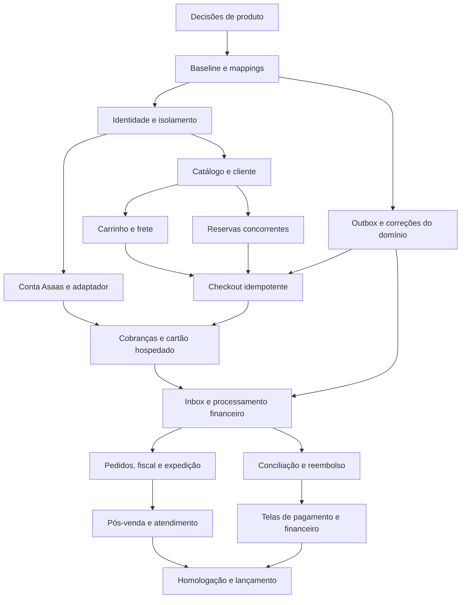

# Roadmap e dependências

## Marcos de entrega

| Marco | Resultado demonstrável | Grupos principais |
|---|---|---|
| M0 — Fundação | Banco/mappings coerentes, pedido básico persiste, identidade/tenant seguros, infraestrutura de eventos | 00–03, BE-06A/FE-06A, 25 |
| M1 — Compra em homologação | Catálogo real, cliente, carrinho, frete, pedido e reserva correta | 04–09, 19 |
| M2 — Pagamento sandbox | Pix/boleto/cartão com estado confiável, estorno e conciliação | 10–11, 16 |
| M3 — Operação | Pedidos, envio, fiscal, pós-venda, suporte e indicadores reais | 12–16, 21–22 |
| M4 — Lançamento | Gates DB/BE/FE completos e operação recuperável | 26 e dependências |
| M5 — Evolução | Promoções, SEO/busca avançada, avaliações/favoritos e importação | 17–18, 20, 28 |
| Condicionais | Split, mensalidade SaaS, condições B2B | 23–24, 27; somente após decisão |

“Venda” nos cartões significa uma capacidade funcional a construir, não autorização para produção. O lançamento comercial exige também operação e gates; provedor fiscal/logístico ou processo assistido real deve estar definido. Cartões de evolução só entram no gate quando habilitados no escopo; não publicar menu de módulo incompleto.

## Caminho principal simplificado

O desenho resume responsabilidades. As dependências exatas, inclusive DB → BE → FE, estão no JSON e em cada cartão. As setas representam pré-requisitos da proposta, não imports do código.

## Ordem topológica calculada

Os lotes abaixo não são sprints nem estimativas. Um desenvolvedor pode executar sequencialmente; frentes independentes podem avançar quando o contrato estiver definido. Decisões pendentes continuam bloqueando trabalho dependente.

| Lote | Cartões liberados após os lotes anteriores |
|---|---|
| 1 | [DEC-01](cartoes/DEC-01.md), [DEC-02](cartoes/DEC-02.md), [DEC-03](cartoes/DEC-03.md), [DB-01](cartoes/DB-01.md) |
| 2 | [BE-01](cartoes/BE-01.md), [DB-02](cartoes/DB-02.md), [DB-25](cartoes/DB-25.md), [DB-00](cartoes/DB-00.md) |
| 3 | [FE-01](cartoes/FE-01.md), [BE-02](cartoes/BE-02.md), [DB-03](cartoes/DB-03.md), [BE-00](cartoes/BE-00.md), [BE-06A](cartoes/BE-06A.md), [BE-00A](cartoes/BE-00A.md) |
| 4 | [FE-02](cartoes/FE-02.md), [BE-03](cartoes/BE-03.md), [DB-04](cartoes/DB-04.md), [DB-06](cartoes/DB-06.md), [DB-10](cartoes/DB-10.md), [DB-19](cartoes/DB-19.md), [FE-06A](cartoes/FE-06A.md) |
| 5 | [FE-03](cartoes/FE-03.md), [BE-04](cartoes/BE-04.md), [DB-05](cartoes/DB-05.md), [BE-06](cartoes/BE-06.md), [DB-07](cartoes/DB-07.md), [DB-08](cartoes/DB-08.md), [BE-10](cartoes/BE-10.md), [DB-18](cartoes/DB-18.md), [BE-19](cartoes/BE-19.md), [DB-22](cartoes/DB-22.md), [DB-24](cartoes/DB-24.md), [BE-25](cartoes/BE-25.md), [FE-25](cartoes/FE-25.md) |
| 6 | [FE-04](cartoes/FE-04.md), [BE-05](cartoes/BE-05.md), [FE-06](cartoes/FE-06.md), [BE-07](cartoes/BE-07.md), [DB-09](cartoes/DB-09.md), [FE-10](cartoes/FE-10.md), [BE-18](cartoes/BE-18.md), [FE-19](cartoes/FE-19.md), [BE-22](cartoes/BE-22.md), [DB-28](cartoes/DB-28.md) |
| 7 | [FE-05](cartoes/FE-05.md), [FE-07](cartoes/FE-07.md), [BE-08](cartoes/BE-08.md), [DB-11](cartoes/DB-11.md), [DB-12](cartoes/DB-12.md), [DB-14](cartoes/DB-14.md), [DB-16](cartoes/DB-16.md), [DB-17](cartoes/DB-17.md), [FE-18](cartoes/FE-18.md), [DB-20](cartoes/DB-20.md), [FE-22](cartoes/FE-22.md), [DB-27](cartoes/DB-27.md), [BE-28](cartoes/BE-28.md) |
| 8 | [FE-08](cartoes/FE-08.md), [BE-09](cartoes/BE-09.md), [BE-11](cartoes/BE-11.md), [BE-11B](cartoes/BE-11B.md), [DB-13](cartoes/DB-13.md), [BE-20](cartoes/BE-20.md), [DB-21](cartoes/DB-21.md), [DB-23](cartoes/DB-23.md), [FE-28](cartoes/FE-28.md) |
| 9 | [FE-09](cartoes/FE-09.md), [BE-11A](cartoes/BE-11A.md), [DB-15](cartoes/DB-15.md), [BE-16](cartoes/BE-16.md), [FE-20](cartoes/FE-20.md), [BE-24](cartoes/BE-24.md) |
| 10 | [BE-11C](cartoes/BE-11C.md), [FE-16](cartoes/FE-16.md), [BE-23](cartoes/BE-23.md), [FE-24](cartoes/FE-24.md), [DB-26](cartoes/DB-26.md), [BE-27](cartoes/BE-27.md) |
| 11 | [BE-11D](cartoes/BE-11D.md), [FE-11](cartoes/FE-11.md), [BE-12](cartoes/BE-12.md), [FE-27](cartoes/FE-27.md) |
| 12 | [BE-11E](cartoes/BE-11E.md), [FE-12](cartoes/FE-12.md), [BE-13](cartoes/BE-13.md), [BE-14](cartoes/BE-14.md), [BE-21](cartoes/BE-21.md) |
| 13 | [FE-11A](cartoes/FE-11A.md), [FE-13](cartoes/FE-13.md), [FE-14](cartoes/FE-14.md), [BE-15](cartoes/BE-15.md), [BE-17](cartoes/BE-17.md), [FE-21](cartoes/FE-21.md) |
| 14 | [FE-15](cartoes/FE-15.md), [FE-17](cartoes/FE-17.md), [FE-23](cartoes/FE-23.md), [BE-26](cartoes/BE-26.md) |
| 15 | [FE-26](cartoes/FE-26.md) |

## Primeira seleção de trabalho

Começar por [DB-01](cartoes/DB-01.md) e pelas decisões [DEC-01](cartoes/DEC-01.md)/[DEC-02](cartoes/DEC-02.md)/[DEC-03](cartoes/DEC-03.md). Após a baseline, [BE-01](cartoes/BE-01.md) e [BE-00](cartoes/BE-00.md) demonstram pedido/histórico persistidos. Em seguida, identidade/tenant e outbox. [BE-06A](cartoes/BE-06A.md)/[FE-06A](cartoes/FE-06A.md) corrigem perda de dados já presente nas telas. Não iniciar a integração financeira como se login e isolamento já estivessem homologados.

## Planejamento de capacidade

Refinar estimativas após a fundação, com ambiente funcionando e decisões de conta/frete/fiscal. A ordem topológica valida possibilidade de execução, mas não calcula caminho crítico em dias: faltam durações e disponibilidade. Alterar IDs/dependências exige revalidar o grafo; módulos condicionais incluídos no lançamento precisam ser adicionados aos gates.

