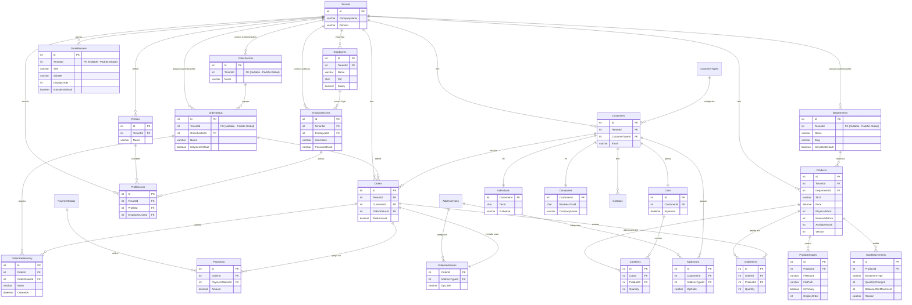

# Arquitetura do Banco de Dados

Abaixo está o diagrama Entidade-Relacionamento do nosso E-commerce:

```mermaid
erDiagram
    %% RELACIONAMENTOS DO SISTEMA HÍBRIDO (GLOBAL + MULTI-TENANT)
    Tenants ||--o{ Customers : "tem"
    Tenants ||--o{ Products : "tem"
    Tenants ||--o{ Orders : "tem"
    Tenants ||--o{ OrderSectors : "possui customizações"
    Tenants ||--o{ OrderStatus : "possui customizações"
    Tenants ||--o{ Departments : "possui customizações"
    Tenants ||--o{ StoreBanners : "possui"
    Tenants ||--o{ Employees : "emprega"
    Tenants ||--o{ EmployeeUsers : "possui acessos"
    Tenants ||--o{ Profiles : "define"
    Tenants ||--o{ ProfileUsers : "vincula"

    OrderSectors ||--o{ OrderStatus : "agrupa"
    OrderStatus ||--o{ Orders : "define"
    OrderStatus ||--o{ OrderStateHistory : "registra"
    
    CustomerTypes ||--o{ Customers : "categoriza"
    AddressTypes ||--o{ Addresses : "categoriza"
    AddressTypes ||--o{ OrderAddresses : "categoriza"
    PaymentStatus ||--o{ Payments : "define"

    Customers ||--|| Individuals : "eh"
    Customers ||--|| Companies : "eh"
    Customers ||--o{ Addresses : "possui"
    Customers ||--o{ Contacts : "tem"
    Customers ||--|| Carts : "possui"
    Customers ||--o{ Orders : "realiza"

    Departments ||--o{ Products : "classifica"
    Products ||--o{ CartItems : "adicionado em"
    Products ||--o{ OrderItems : "pedido em"
    Products ||--o{ StockMovements : "audita"
    Products ||--o{ ProductImages : "possui"
    Carts ||--o{ CartItems : "contem"

    Orders ||--o{ OrderStateHistory : "rastreia"
    Orders ||--|| OrderAddresses : "enviado para"
    Orders ||--o{ OrderItems : "contem"
    Orders ||--o{ Payments : "pago via"

    Employees ||--o{ EmployeeUsers : "possui login"
    Profiles ||--o{ ProfileUsers : "concede"
    EmployeeUsers ||--o{ ProfileUsers : "possui"

    %% ESTRUTURA DAS TABELAS ATUALIZADA (HÍBRIDA + BACKOFFICE)
    Tenants {
        int Id PK
        varchar CompanyName
        varchar Domain
    }

    OrderSectors {
        int Id PK
        int TenantId "FK (Nullable - Padrão Global)"
        varchar Name
    }

    OrderStatus {
        int Id PK
        int TenantId "FK (Nullable - Padrão Global)"
        int OrderSectorId FK
        varchar Name
        boolean IsSystemDefault
    }

    Departments {
        int Id PK
        int TenantId "FK (Nullable - Padrão Global)"
        varchar Name
        varchar Slug
        boolean IsSystemDefault
    }

    StoreBanners {
        int Id PK
        int TenantId "FK (Nullable - Padrão Global)"
        varchar Title
        varchar Subtitle
        int DisplayOrder
        boolean IsSystemDefault
    }

    Customers {
        int Id PK
        int TenantId FK
        int CustomerTypeId FK
        varchar Email
    }

    Individuals {
        int CustomerId PK
        char TaxId
        varchar FullName
    }

    Companies {
        int CustomerId PK
        char BusinessTaxId
        varchar CompanyName
    }

    Addresses {
        int Id PK
        int CustomerId FK
        int AddressTypeId FK
        varchar ZipCode
    }

    Products {
        int Id PK
        int TenantId FK
        int DepartmentId FK
        varchar SKU
        decimal Price
        int PhysicalStock
        int ReservedStock
        int AvailableStock
        int Version
    }

    StockMovements {
        int Id PK
        int ProductId FK
        varchar MovementType
        int QuantityChanged
        int BalanceAfterMovement
        varchar Reason
    }

    ProductImages {
        int Id PK
        int ProductId FK
        varchar FileName
        varchar FilePath
        boolean IsPrimary
        int DisplayOrder
    }

    Carts {
        int Id PK
        int CustomerId FK
        datetime ExpiresAt
    }

    CartItems {
        int Id PK
        int CartId FK
        int ProductId FK
        int Quantity
    }

    Orders {
        int Id PK
        int TenantId FK
        int CustomerId FK
        int OrderStatusId FK
        decimal TotalAmount
    }

    OrderStateHistory {
        int Id PK
        int OrderId FK
        int OrderStatusId FK
        varchar Notes
        datetime CreatedAt
    }

    OrderAddresses {
        int OrderId PK
        int AddressTypeId FK
        varchar ZipCode
    }

    OrderItems {
        int Id PK
        int OrderId FK
        int ProductId FK
        int Quantity
    }

    Payments {
        int Id PK
        int OrderId FK
        int PaymentStatusId FK
        decimal Amount
    }

    Employees {
        int Id PK
        int TenantId FK
        varchar Name
        char Cpf
        decimal Salary
    }

    EmployeeUsers {
        int Id PK
        int TenantId FK
        int EmployeeId FK
        varchar Username
        varchar PasswordHash
    }

    Profiles {
        int Id PK
        int TenantId FK
        varchar Name
    }

    ProfileUsers {
        int Id PK
        int TenantId FK
        int ProfileId FK
        int EmployeeUserId FK
    }
```
